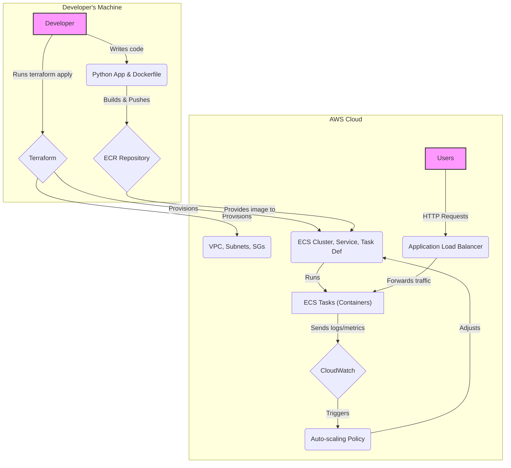

# AWS ECS Fargate Deployment


This Terraform project provisions a complete, production-ready AWS ECS environment using Fargate. It includes a an ECR repository, a dashboard service, an ECS task definition, a load balancer, and all the necessary networking and IAM components.

The setup is designed to deploy a custom dummy Python application using MonsterUI defined in `dashboard.py` and the `Dockerfile`.

## Prerequisites

1.  **AWS Account**: An [AWS](https://aws.amazon.com/) account with the necessary permissions.
2.  **AWS CLI (Configured)**: [awscli](https://aws.amazon.com/cli/) Your AWS credentials should be configured locally, typically via `aws configure`.
3.  **Docker**: [Docker](https://www.docker.com/) must be installed and running to build the container image.
4.  **Terraform CLI**: Ensure you have the [Terraform](https://developer.hashicorp.com/terraform) CLI installed ([OpenTofu](https://opentofu.org/) will also work).
5.  **jq**: A lightweight and flexible command-line JSON processor, [jq](https://jqlang.org/) is nice to have, but not essential.

## Usage

1.  **Clone/Copy Files**: Place all the project files in a new directory.

2.  **Create a Variables File**: In the `terraform` directory, copy the example variables file:
    ```sh
    cd terraform
    cp terraform.tfvars.example terraform.tfvars
    ```

3.  **Customize `terraform.tfvars`**: Open `terraform/terraform.tfvars` and fill in the required values for `project_name`, `aws_region`, and `docker_image_tag`. It is recommended to use a unique tag for each new image, such as the Git commit SHA.

4.  **Initialize Terraform**: Run `terraform init` from the `terraform` directory.
    ```sh
    cd terraform
    terraform init
    ```

5.  **First Deployment**: Apply the configuration to create the initial infrastructure, including the ECR repository.
    ```sh
    terraform apply
    ```

6.  **Build and Push the Docker Image**: From the project root directory, run the `build-and-push.sh` script. This will build your Docker image for the `linux/amd64` platform and push it to the newly created ECR repository. ECS will detect and deploy it.
    ```sh
    cd ..
    ./build-and-push.sh
    ```
    *Note 1: You may need to adjust the `AWS_REGION`, `PROJECT_NAME`, and `IMAGE_TAG` variables inside the script if they differ from your `terraform.tfvars`.*

    *Note 2: You might run into docker login issues when running this over `ssh`.*

7.  **Open the App**: After a minute or so you can access your running application.
    ```sh
    cd terraform
    URL=$(terraform output -json | jq -r .load_balancer_dns_name.value)
    open http://$URL
    ```

## Cleaning Up

To destroy all the resources created by this project, run `terraform destroy` from within the `terraform` directory:
```sh
terraform destroy
```


