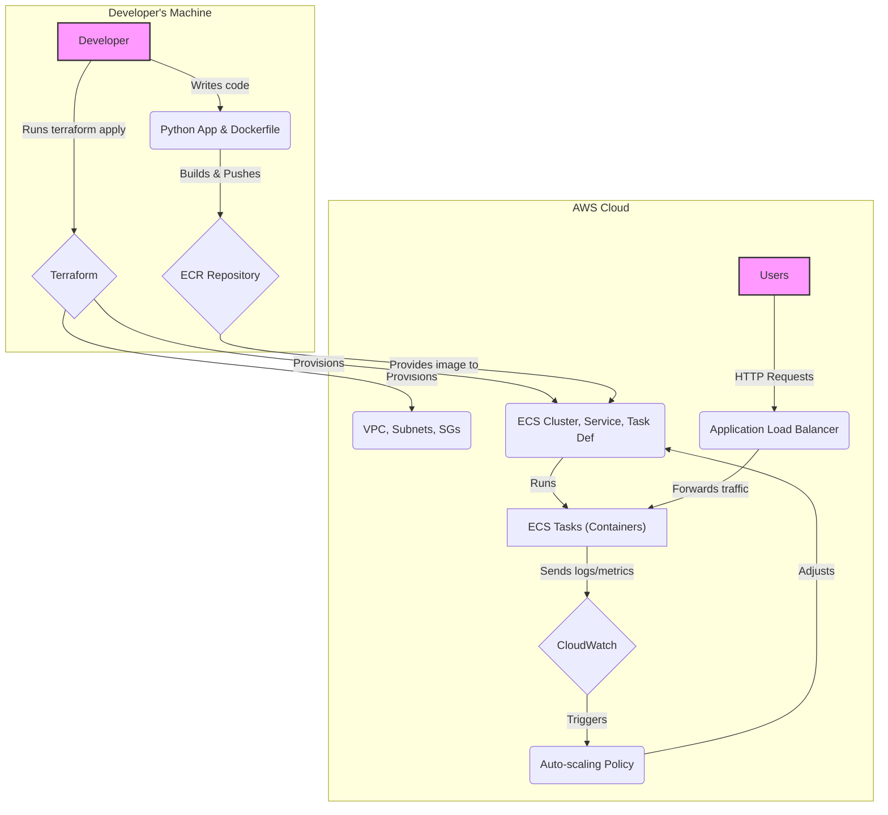

# AWS ECS Fargate Deployment


This project provisions a complete, production-ready AWS ECS environment using Fargate. It includes a an ECR repository, a dashboard service based on Python and FastHTML, an ECS task definition, a load balancer, and all the necessary networking and IAM components.

The setup is designed to deploy a custom dummy Python application using MonsterUI defined in `dashboard.py` and the `Dockerfile`.

## Prerequisites

1.  **AWS Account**: An [AWS](https://aws.amazon.com/) account with the necessary permissions.
2.  **AWS CLI (Configured)**: [awscli](https://aws.amazon.com/cli/) Your AWS credentials should be configured locally, typically via `aws configure`.
3.  **Docker**: [Docker](https://www.docker.com/) must be installed and running to build the container image.
4.  **Terraform CLI**: Ensure you have the [Terraform](https://developer.hashicorp.com/terraform) CLI installed ([OpenTofu](https://opentofu.org/) will also work).
5.  **jq**: A lightweight and flexible command-line JSON processor, [jq](https://jqlang.org/) is nice to have, but not essential.

## Configure
```bash
cp terraform/terraform.tfvars.example terraform/terraform.tfvars
# Edit terraform/terraform.tfvars: project_name, aws_region, docker_image_tag
```

## Quickstart (Make targets)
```bash
make setup      # initialize Terraform and bootstrap tfvars if missing
make deploy     # apply infra (incl. ECR) and build+push image

# Get and test the service URL
make url        # prints http://<alb-dns>
curl $(make -s url)

# Or open in a browser (macOS)
make open
```

## Smoke Testing
```bash
make smoke
```
What it does:
- Polls the Load Balancer URL until it returns HTTP 200

## Cleaning Up
```bash
make destroy
```

## End-to-End Test
```bash
make e2e
```
`


