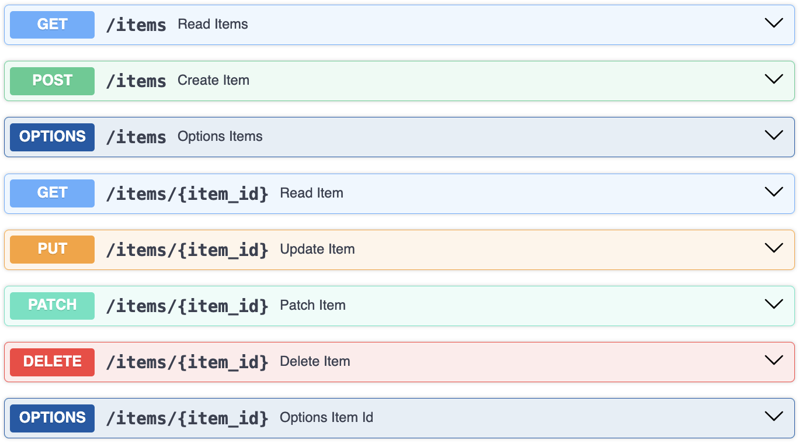

# FastAPI Basic Starter

A minimal FastAPI server demonstrating all common HTTP methods with tests.


 
## Setup and Usage

This project uses `uv` for dependency management.

1.  **Install dependencies:**

```bash
uv sync
```

2.  **Configure the port:**

Copy the example file to `.env` and then edit the desired local port in it.

```bash
cp .env.example .env
```

3.  **Run the server:**

```bash
source .env && uv run uvicorn main:app --port $PORT --reload
# or
uv run main.py
```

4.  **Smoke-test the Server:**

This is an example `curl` commands to test one API endpoint (you can run more when executing the file `test_curl.sh`).

```bash
# Get all items
curl -X GET http://127.0.0.1:8000/items
```

The server will be available like at `http://127.0.0.1:8000`. You can access the interactive API documentation at `http://127.0.0.1:8000/docs`.

## Run inside Docker

Build and run the application using Docker:

```bash
docker compose up -d
# or
docker build -t fastapi-basic .
docker run -d -p 9000:8000 --env-file ./.env --name fastapi-basic-app fastapi-basic
```

This command maps the host port `9000` on the container port `8000`.

## Run Testsuite

```bash
❯ uv run pytest
====================== test session starts ======================
platform darwin -- Python 3.12.10, pytest-8.4.1, pluggy-1.6.0
rootdir: /path/to/fastapi-basic
configfile: pyproject.toml
plugins: anyio-3.7.1, asyncio-1.0.0
asyncio: mode=Mode.STRICT, asyncio_default_fixture_loop_scope=None, asyncio_default_test_loop_scope=function
collected 24 items                                              

test_real.py ............                                 [ 50%]
test_testclient.py ............                           [100%]

====================== 24 passed in 2.80s =======================
```

## Next Steps

Take this building block as a starting base to do things like the following:

- Add a FastAPI [middleware](https://fastapi.tiangolo.com/tutorial/middleware/) for logging or benchmarking.
- Add rate limitation with a package like [SlowAPI](https://slowapi.readthedocs.io/en/latest/).
- Integrate a database with [SQLModel](https://sqlmodel.tiangolo.com/) or [SQLAlchemy](https://www.sqlalchemy.org/) for data persistence.
- Add user authentication and authorization using [FastAPI's security utilities](https://fastapi.tiangolo.com/tutorial/security/).
- Implement more robust configuration management using [Pydantic's settings management](https://docs.pydantic.dev/latest/usage/settings/).
- Enable Cross-Origin Resource Sharing (CORS) with [CORSMiddleware](https://fastapi.tiangolo.com/tutorial/cors/) to allow frontend applications to interact with the API.
- Use [Background Tasks](https://fastapi.tiangolo.com/tutorial/background-tasks/) for long-running operations that don't need to be completed before the response is sent.
