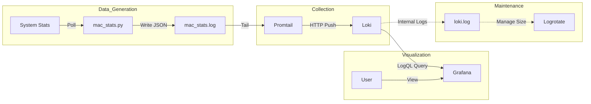

# System Architecture

This document describes the architecture of the log processing pipeline, detailing the components, their configuration, data flow, and lifecycle management.

## 1. Component Overview

The system is a local log aggregation and visualization pipeline composed of four main components:

1.  **`mac_stats.py` (Log Generator)**: A custom Python script that collects system metrics (CPU, memory, battery).
2.  **Promtail (Log Collector)**: An agent that ships contents of local log files to a private Loki instance.
3.  **Loki (Log Aggregator)**: A horizontally-scalable, highly-available, multi-tenant log aggregation system.
4.  **Grafana (Visualization)**: A platform for querying and visualizing the data stored in Loki.
5.  **Logrotate (Maintenance)**: A utility to manage the file size of logs generated by the system services themselves.

## 2. Component Configuration & Responsibilities

### A. mac_stats.py (Source)
*   **Role**: Generates raw data.
*   **Configuration**: Internal python logic (no external config file).
*   **Action**:
    *   Polls system stats (via `top`, `memory_pressure`, `pmset`) every 10 seconds.
    *   Writes JSON-formatted log lines to `mac_stats.log`.
*   **Key File**: `mac_stats.py`

### B. Promtail (Collector)
*   **Role**: Reads the log file and pushes to Loki.
*   **Configuration**: `promtail-local-config.yaml`
    *   **Positions**: Stores reading offsets in `positions.yaml` to survive restarts.
    *   **Scrape Config**:
        *   Tails: `mac_stats.log`
        *   Job Name: `macbook_stats`
    *   **Pipeline**: Parses JSON content to extract labels (`component`, `power_source`).
    *   **Client**: Pushes to `http://localhost:3100/loki/api/v1/push`.

### C. Loki (Aggregator)
*   **Role**: Stores and indexes log streams.
*   **Configuration**: `loki-local-config.yaml` (or Homebrew default at `/opt/homebrew/etc/loki-local-config.yaml`)
    *   **Server**: Listens on HTTP port `3100` and GRPC `9096`.
    *   **Storage**: Stores chunks and indexes in a local directory (e.g., `.loki-data` or `/tmp/loki`).
    *   **Log Level**: Controls its own internal logging verbosity (debug/warn).

### D. Grafana (UI)
*   **Role**: Visualizes the data.
*   **Configuration**:
    *   **Datasource**: Configured via UI to point to Loki (`http://localhost:3100`).
    *   **Dashboard**: `mac_stats_dashboard.json` contains the panel definitions and LogQL queries.
*   **Access**: `http://localhost:3000`

### E. Logrotate (System Health)
*   **Role**: Rotates Loki's internal service logs to prevent disk fill-up.
*   **Configuration**: `/opt/homebrew/etc/logrotate.d/loki`
    *   **Rules**: Rotate when size > 100M, keep 5 versions, compress old logs.

## 3. Data Flow

1.  `mac_stats.py` writes a new line to `mac_stats.log`.
2.  Promtail detects the change, reads the new line, extracts labels, and pushes the stream to Loki's API.
3.  Loki accepts the stream and appends it to its chunks in storage.
4.  Grafana queries Loki (e.g., `avg_over_time({job="macbook_stats"} | json | unwrap cpu_usage_percent [1m])`) and renders the chart.

## 4. Lifecycle Management

### Starting the Pipeline
The system can be started in two main modes:

1.  **Fully Local (Dev Mode)**:
    *   Command: `make run-all` (executes `scripts/run_all_processes.sh`)
    *   Behavior: Starts Loki, Promtail, and `mac_stats.py` as background processes within the current shell session.

2.  **Hybrid (Service Mode)**:
    *   Command: `make run` (executes `run_all.sh`)
    *   Behavior: Assumes Loki and Grafana are running as system services (via `brew services start ...`). Only starts the user-space tools (Promtail and `mac_stats.py`) locally.

### Stopping the Pipeline
*   **Local Mode**: `Ctrl+C` in the terminal running the script. The script traps the signal and kills the background PIDs (`kill $PID`).
*   **Service Mode**: `Ctrl+C` stops the local scripts. System services must be stopped separately (`brew services stop loki`).

### Persistence
*   **Promtail**: Remembers where it left off reading `mac_stats.log` using `positions.yaml`.
*   **Loki**: Persists data in its configured storage directory (`.loki-data` or `/tmp`). detailed in `loki-local-config.yaml`.
